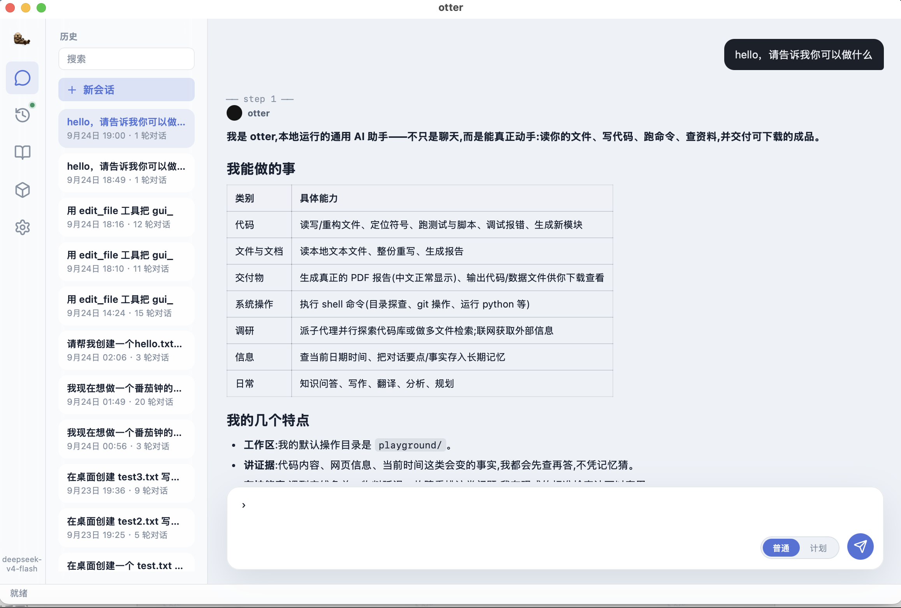
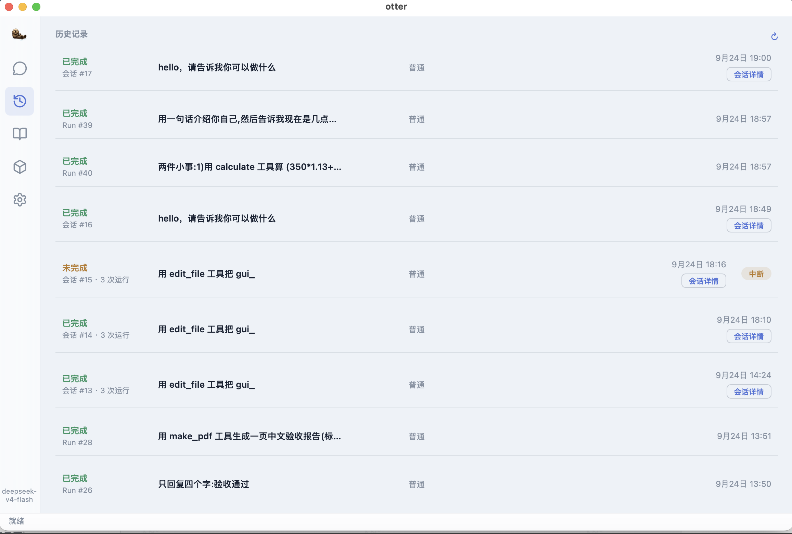
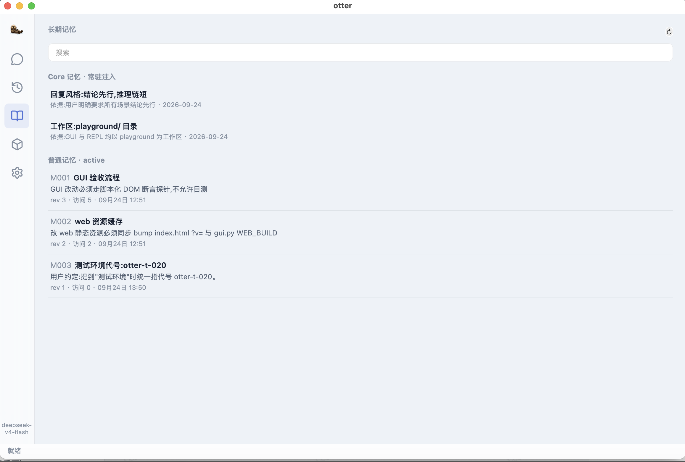
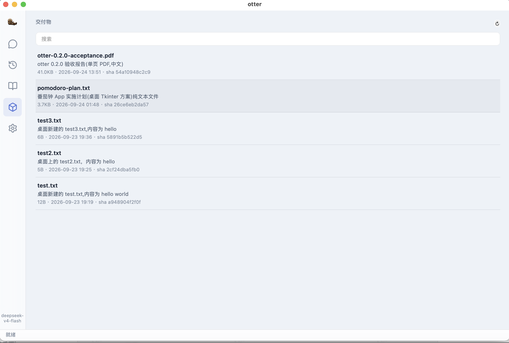

<div align="center">

# otter 🦦

**Give an agent a computer, and it brings you shells.**

轻量级本地**通用 AI 助手**——能写代码、读写文件、跑命令、查网页、做分析与文档,也处理日常问答。
水獭:自然界"抱着石头敲贝壳"的会用工具的动物,正是"给 agent 一台电脑"的画像。


[演示](#demo) · [能力](#otter-能做什么) · [架构](#如何拼在一起) · [快速开始](#快速开始) · [路线图](#路线图状态)

</div>

otter 在你的机器上本地运行:一个五拍循环的 Agent 引擎(停止评估 → 请求组装 → 上下文压缩 → 流式调模型 → 工具分岔),配一套为长期工作设计的基础设施——**双层记忆、技能沉淀、证据归档、产物交付、中断恢复、费用预算**。CLI 与桌面 GUI 同引擎。

> 当前为本地开发版本,接口与数据格式仍可能调整。

## Demo

截图来自真实 Run,非概念稿。

### 对话与交付

<p align="center">
  
</p>

<p align="center"><sub>通用助手身份 · 流式回答 · 📦 产物卡片内联预览</sub></p>

<details open>
<summary><strong>运行历史 / 长期记忆 / 交付物</strong></summary>

<p align="center">
  
</p>

<p align="center"><sub>按会话聚合的历史:完成状态 · 摘要对齐 · 普通/计划模式 · 点击行跳回会话</sub></p>

<p align="center">
  
</p>

<p align="center"><sub>双层记忆可视化:Core 常驻注入 · Ordinary 按需读取 · 出处可溯</sub></p>

<p align="center">
  
</p>

<p align="center"><sub>交付物浏览:发布历史 · 内联预览(PDF/图片/代码)· 打开/Finder/VS Code</sub></p>

</details>

## otter 能做什么

- **通用助手身份** — 编码、文件、命令、网页、计算、日常问答;实时信息(时间/网页)强制走工具,不凭训练记忆。
- **多端点接入** — OpenAI 兼容协议(DeepSeek/OpenAI/Qwen/Ollama)+ **Anthropic 原生 Messages API**(改 base_url 自动切换)。
- **双层记忆** — Core Memory 常驻注入,Ordinary Memory 建索引按需读取,Run 后反思更新,乐观锁防幻觉写。
- **Plan / Act 双模式** — PLAN 只读调查并产出结构化计划,人工采纳后切执行跑。
- **Skill 体系** — 从真实 Run 提炼候选,人工确认转正;运行时 `<skills>` 注入,`skill_read` 按需取全文。
- **Evidence 归档** — 工具输出截断前全文入库(sha256),模型可随时回取原文。
- **Artifact 交付** — 文件/报告/PDF 作为可追踪交付物发布,GUI 内联预览+三通道打开;`make_pdf` 原生生成真 PDF。
- **安全边界** — 权限审批三层 fail-closed(规则/会话/弹窗)、写盘 diff 确认(同目录一次放行)、可选 Seatbelt 沙箱、二进制魔数校验(防伪造 PDF)。
- **中断恢复** — Checkpoint 记录中断边界,`--resume` 续跑;kill -9 也不丢状态。
- **费用预算** — Run 级预算三段收口:60% 提醒 → 85% 收口 → 100% 硬停。
- **上下文管理** — tiktoken 事前估算 + 滚动摘要压缩(作用于请求视图,原始历史不动)。
- **MCP 扩展** — stdio MCP Server 接入外部工具,经同一权限/执行/Trace 链路。
- **headless** — `-p` 单任务 + `--output-format stream-json` NDJSON 流式输出,CI/cron 直接消费。
- **桌面 GUI** — 五页工作台:对话/历史/记忆/交付物/设置,rail 徽标提醒新事件。

## 如何拼在一起

```text
CLI(REPL / -p / cron)      桌面 GUI(pywebview)
        └──────────┬──────────┘
             AgentLoop(五拍循环)
   停止评估 → 请求组装 → 压缩 → 流式调用 → 工具分岔
        │              │                │
   工具注册表      上下文视图         模型 adapter
   (含 deferred)  (system+记忆+技能   ├─ OpenAI 兼容
        │          +摘要+计划)        └─ Anthropic 原生
        │                                ↓
  权限审批 → diff 确认 → 沙箱 → 执行      usage 记账
        │
  Trace 落库 · Evidence 归档 · Checkpoint · FILE_CHANGED/ARTIFACT 事件

Run 后:记忆反思更新 · Skill 提炼(人工确认才转正)
```

## 核心概念

| 概念 | 职责 |
| --- | --- |
| Run | 一次任务执行的完整生命周期(事件可回放) |
| Trace | Run 实际发生了什么(模型/工具/审批/压缩全量落库) |
| Evidence | 被截断工具输出的全文归档,可按 sha256 回取 |
| Artifact | Run 的可交付产物(文件/PDF),发布进产物面板 |
| Memory | Core(常驻事实)+ Ordinary(按需知识)双层记忆 |
| Skill | 可复用的任务方法,提炼需人工确认,运行时注入 |
| Checkpoint | 中断恢复的边界,`--resume` 从此续跑 |
| Plan | 只读调查后产出的结构化计划,采纳后才执行 |

## 快速开始

需要 Python 3.12+;GUI 为可选依赖(macOS 最佳)。

```bash
pip install otter-agent          # 从 PyPI(GUI 可选:pip install "otter-agent[gui]")

# 或从源码
git clone https://github.com/Zzz777-coder/otter.git && cd otter
python3 -m venv .venv && .venv/bin/pip install -e ".[dev]"
cp .env.example .env             # 填入 OTTER_API_KEY
```

```bash
otter                      # 交互 REPL(/init /undo /plan /context 等斜杠命令)
otter --gui                # 桌面 GUI
otter -p "任务描述"         # 单任务模式
otter -p "任务" --plan     # PLAN 只读模式(调查+计划,不写文件)
otter -p "任务" --yes --output-format stream-json   # headless:NDJSON 流式(CI/cron)
```

支持端点:DeepSeek/OpenAI/Qwen/Ollama 等 OpenAI 兼容协议;**Anthropic 原生**只需 `OTTER_BASE_URL=https://api.anthropic.com`。配置项见 `.env.example`。

### 部署:单人云服务器 + 定时任务

otter 是单用户本地工具(状态在工作区 `.otter/` 内);GUI 为桌面壳不支持远程,服务器走 CLI:

```bash
# 定时无人值守:系统 cron + headless stream-json(NDJSON 落日志)
15 9 * * * cd ~/myproject && otter -p "跑测试并总结失败原因" \
    --yes --output-format stream-json >> .otter/cron.log 2>&1
```

多人 SaaS(每用户自带 key、Web 访问)不在当前架构内;如需请自行包 HTTP 层并做会话隔离。

## 开发检查

```bash
.venv/bin/python -m pytest tests/ -v    # 后端全离线(128 用例)
node tests/test_web_render.js           # 前端渲染冒烟(71 断言)
# GUI 真机探针(真实窗口 DOM 断言,非目测):
.venv/bin/otter --gui-artifact-probe    # 产物卡片 18 项
.venv/bin/otter --gui-e2e               # 真任务→diff 确认→写盘 8 项
```

## 目录结构

```text
otter/
├── otter/
│   ├── loop.py            AgentLoop 五拍循环(核心)
│   ├── tools/             工具子系统(内置/通用/deferred/权限)
│   ├── models/            adapter 层(OpenAI 兼容 + Anthropic 原生 + 工厂)
│   ├── context/           token 估算 + 滚动摘要压缩
│   ├── memory.py          双层记忆(Core/Ordinary + FTS5)
│   ├── skills.py          Skill 提炼/转正/运行时注入
│   ├── evidence.py        截断前全文归档
│   ├── artifact.py        交付物系统 + make_pdf
│   ├── store.py           事件态持久化(SQLite)
│   ├── repl.py / __main__.py   CLI(REPL/-p/headless stream-json)
│   ├── gui.py + web/      桌面 GUI(pywebview + 自写 HTML/CSS/JS)
│   └── replan.py          领域扩展示例(默认关,OTTER_REPLAN=1 开)
├── tests/                 离线测试(后端 pytest + 前端 node)
├── playground/            默认工作区(.otter/ 状态在内)
└── docs/assets/           截图
```

## 路线图状态

| 里程碑 | 内容 | 状态 |
|---|---|---|
| M0 | Loop 五拍 + bash/read/write + DeepSeek adapter + REPL | ✅ 2026-09-19 |
| M1 | edit/grep/glob + 滚动摘要 + AGENTS.md + git 自动提交/undo + Plan/Act | ✅ 2026-09-22 |
| M2 | 权限审批 + Seatbelt 沙箱 + Checkpoint/resume + Evidence + headless | ✅ 2026-09-22 |
| M3 | 双层记忆 + repo map + 分层 edit format + deferred 工具 + Run 预算三段 | ✅ 2026-09-22 |
| M3.5 | diff 预览 + GUI 审批卡片 + 前端冒烟测试 | ✅ 2026-09-22 |
| M4 | MCP 客户端 + 子代理 + Skill Learning + Artifact + 领域扩展示例 + 打包 | ✅ 2026-09-22 |
| M-GUI | v7+:pywebview+HTML;2026-09-24 增记忆页/交付物页/rail 徽标 | ✅ |
| 2026-09-24 | Anthropic 原生 adapter · stream-json · Skill 运行时注入 · 身份通用化(通用 AI 助手 + current_time/web_fetch/calculate) | ✅ |

## 边界

- 单用户本地工具,不是公网多租户服务;
- GUI 桌面壳当前以 macOS 为最佳平台;
- 屏幕操控(Computer Use)未做,集成优先不自研;
- Skill 候选提炼后需人工确认,绝不自动转正。

## License

MIT(见 [LICENSE](LICENSE))。
